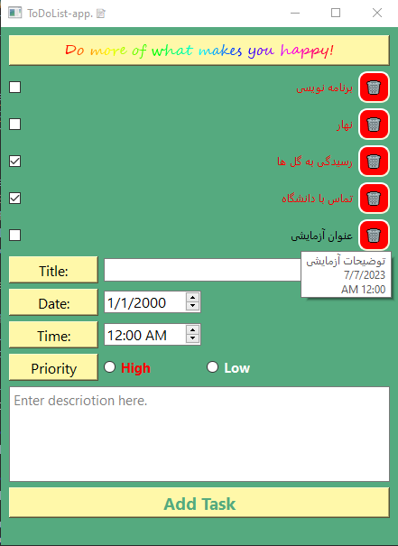

# Qt-and-Sqlite
Applications using QT-Designer and SQLite-db browser

## TO Do List- app.
---------------------------

- Language: Python
- Modules: PySide6- SqLite3
- Picture:

- for making .exe file:
  1) pip install pyinstaller
  2) pyinstaller main.py --onefile
  3) copy .db database file and paste in dist folder

